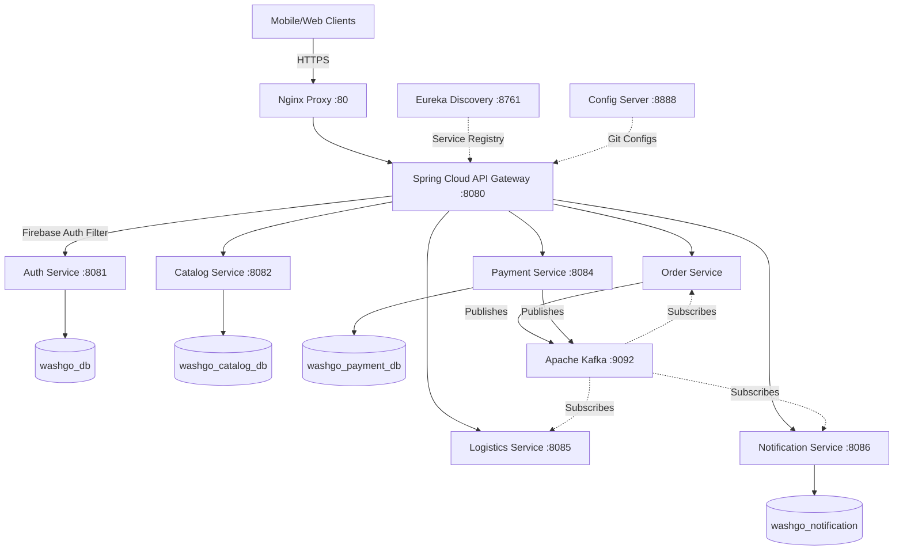
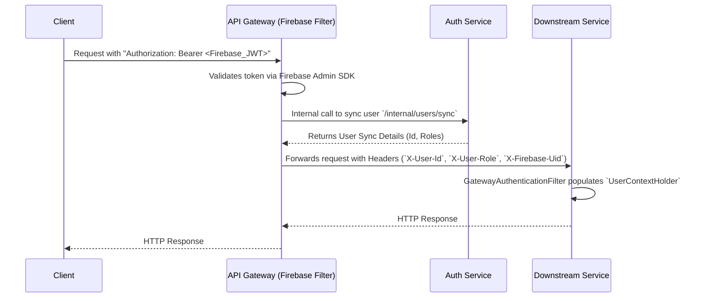

# WashGo Backend API Documentation

Welcome to the official documentation for the **WashGo Backend API**. This document provides a comprehensive overview of the architecture, microservices, infrastructure, and event-driven flows for the WashGo laundry platform.

## Table of Contents
1. [Architecture Overview](#architecture-overview)
2. [Technology Stack](#technology-stack)
3. [Infrastructure & Services](#infrastructure--services)
4. [API Gateway Routes](#api-gateway-routes)
5. [Authentication Flow](#authentication-flow)
6. [Event-Driven Architecture (Kafka)](#event-driven-architecture-kafka)
7. [Shared Components](#shared-components)
8. [Database Architecture](#database-architecture)
9. [API Endpoint Summary](#api-endpoint-summary)
10. [Getting Started (Local Development)](#getting-started-local-development)
11. [Environment Variables](#environment-variables)
12. [Docker Setup Reference](#docker-setup-reference)

---

## Architecture Overview

WashGo is built on a modern **Microservices Architecture** utilizing Spring Boot, Spring Cloud, and an Event-Driven pattern via Apache Kafka. 



---

## Technology Stack

- **Framework**: Spring Boot 3.5.3, Java 21
- **Cloud ecosystem**: Spring Cloud 2025.0.0 (Eureka, Config, Gateway)
- **Database**: PostgreSQL 16
- **Messaging**: Apache Kafka
- **Authentication**: Firebase Admin SDK (JWT Bearer Token)
- **Infrastructure**: Docker, Nginx

---

## Infrastructure & Services

### Microservices

1. **Auth Service (Port 8081)**: Manages Firebase authentication, user synchronization, role management, and JWT handling.
2. **Catalog Service (Port 8082)**: Manages laundry partners, services, items, and pricing structures.
3. **Order Service**: Handles order placement, cart management, status updates, and order tracking. (Port dynamically resolved via Config Server).
4. **Payment Service (Port 8084)**: Manages payments, Razorpay integration, refunds, and transaction logging.
5. **Logistics Service (Port 8085)**: Manages delivery partner assignments, OTP verifications, and delivery status.
6. **Notification Service (Port 8086)**: Responsible for sending email, SMS, and push notifications acting as a consumer of various Kafka topics.

### Shared Infrastructure

- **API Gateway (Port 8080)**: Acts as the single entry point. Provides routing, Firebase JWT verification, context propagation, CORS, and centralized logging.
- **Eureka Discovery Server (Port 8761)**: Dynamic service registration and discovery.
- **Config Server (Port 8888)**: Centralized configuration management powered by Git (`https://github.com/prakashh45/washgo-config.git`).

---

## API Gateway Routes

All client requests are routed through the API Gateway (`https://api.washgo.in`).

| Service | Route Pattern | Target Destination |
|---------|--------------|-------------------|
| **Auth** | `/api/v1/auth/**` | `auth-service:8081` |
| **Catalog** | `/api/catalog/**`, `/api/v1/catalog/**` | `catalog-service:8082` |
| **Order** | `/api/v1/orders/**`, `/api/v1/cart/**` | `order-service:8083` |
| **Payment** | `/api/v1/payments/**`, `/api/v1/razorpay/**` | `payment-service:8084` |
| **Logistics** | `/api/v1/delivery-partners/**`, `/api/v1/assignments/**` | `logistics-service:8085` |
| **Notification**| `/api/v1/notifications/**`| `notification-service:8086` |

---

## Authentication Flow

WashGo uses Firebase for identity management. The API Gateway validates tokens globally before routing requests to downstream microservices.



---

## Event-Driven Architecture (Kafka)

Services communicate asynchronously using Kafka to ensure high availability and loose coupling.

### Kafka Topics
- `order-created`, `order-accepted`, `order-delivered`, `order-created-dlt`
- `payment-created`, `payment-success`, `payment-failed`, `payment-refund`

### Consumer Groups
- `order-group`
- `notification-group`
- `logistics-group`
- `payment-group`

---

## Shared Components

To maintain consistency, a `common` module is imported across all microservices containing:
- **Enums**: `Role` (CUSTOMER, PARTNER, ADMIN), `OrderStatus` (15 defined values), `PaymentMethod` (5 values).
- **DTOs**: Standardized payloads like `SyncUserRequest`, `SyncUserResponse`.
- **Security Context**: `GatewayConstants` (headers like `X-Gateway-Key`), `UserContext`, `UserContextHolder`.
- **Kafka Configurations**: `KafkaConstants`, `TopicConfig`, `OrderCreatedEvent`, `PaymentSuccessEvent`.
- **Response Wrappers**: `ApiResponse<T>` for consistent JSON structures.

---

## Database Architecture

Microservices adhere to the database-per-service pattern using **PostgreSQL 16**.
- **Auth Service**: `washgo_db`
- **Catalog Service**: `washgo_catalog_db`
- **Payment Service**: `washgo_payment_db`
- **Notification Service**: `washgo_notification`
- **Order/Logistics**: Managed in their respective schemas.

---

## API Endpoint Summary

Below is a high-level summary of the domains handled by each service. (See individual service documentation for detailed endpoint specs).

| Service | Endpoints Scope | Access Required |
|---------|----------------|----------------|
| **Auth** | User sync, profile management, role assignment | `CUSTOMER`, `PARTNER`, `ADMIN` |
| **Catalog** | Partners lookup, service list, item definitions | Public / All Roles |
| **Order** | Cart management, order creation, order tracking | `CUSTOMER`, `PARTNER` |
| **Logistics** | Delivery assignment, OTP validation | `PARTNER`, `ADMIN` |
| **Payment** | Initiate payment, webhook listeners, refunds | `CUSTOMER` / System |

---

## Getting Started (Local Development)

### Prerequisites
- JDK 21
- Maven
- Docker & Docker Compose
- PostgresSQL 16 (or use Docker)

### Bootstrapping Services

1. **Start Infrastructure Services**:
   Ensure PostgreSQL and Kafka are running on your machine.
   ```bash
   docker-compose up -d postgres kafka zookeeper
   ```
2. **Start Spring Cloud Services** (Must be in this order):
   - **Discovery Server** (`localhost:8761`)
   - **Config Server** (`localhost:8888`)
   - **API Gateway** (`localhost:8080`)
3. **Start Core Microservices**:
   Run Auth, Catalog, Order, Logistics, Payment, and Notification services via your IDE or `mvn spring-boot:run`.

---

## Environment Variables

When running locally or in Docker, the following core environment variables are typically required:

```env
# Database configurations
SPRING_DATASOURCE_URL=jdbc:postgresql://localhost:5432/washgo_db
SPRING_DATASOURCE_USERNAME=postgres
SPRING_DATASOURCE_PASSWORD=yourpassword

# Kafka configuration
SPRING_KAFKA_BOOTSTRAP_SERVERS=localhost:9092

# Firebase JSON path
FIREBASE_CONFIG_PATH=classpath:firebase-service-account.json

# Eureka configuration
EUREKA_CLIENT_SERVICEURL_DEFAULTZONE=http://localhost:8761/eureka
```

---

## Docker Setup Reference

For a complete containerized environment, refer to the root `docker-compose.yml`.

```bash
# Build all services
mvn clean package -DskipTests

# Start the entire stack
docker-compose up --build -d

# View logs
docker-compose logs -f api-gateway
```
